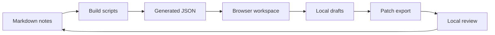

# 시스템 인터페이스 맵

## 요약

AI Context as Code에는 세 가지 작업면이 있어요.
Markdown file이 원본예요.
Build script는 원본을 브라우저가 읽을 수 있는 data로 바꿔요.
Site는 사람과 AI 에이전트가 탐색하고, 검토하고, 변경 초안을 만들 수 있는 공간을 제공해요.

## 맵

## 경계

브라우저 workspace는 변경 초안을 만들고 export할 수 있어요.
하지만 저장소를 조용히 바꾸지 않아요.
이 경계는 로컬 experiment 비용을 낮추면서도 배포 전 검토를 지켜줘요.

## 관련

- [[approval-before-external-side-effects]]
- [[reviewable-ai-workflows]]
- [[runtime-verification]]
