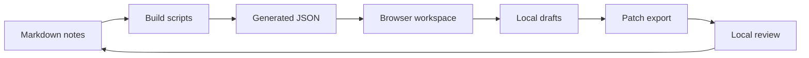

# System Interface Map

## Summary

acac.sh has three working surfaces.
Markdown files are the source.
Build scripts turn the source into browser-readable data.
The site gives humans and AI agents a way to browse, inspect, and draft changes.

## Map

## Boundary

The browser workspace can draft and export changes.
It does not silently change the repository.
That boundary keeps local experimentation cheap while preserving review before deployment.

## Related

- [[approval-before-external-side-effects]]
- [[reviewable-ai-workflows]]
- [[runtime-verification]]
