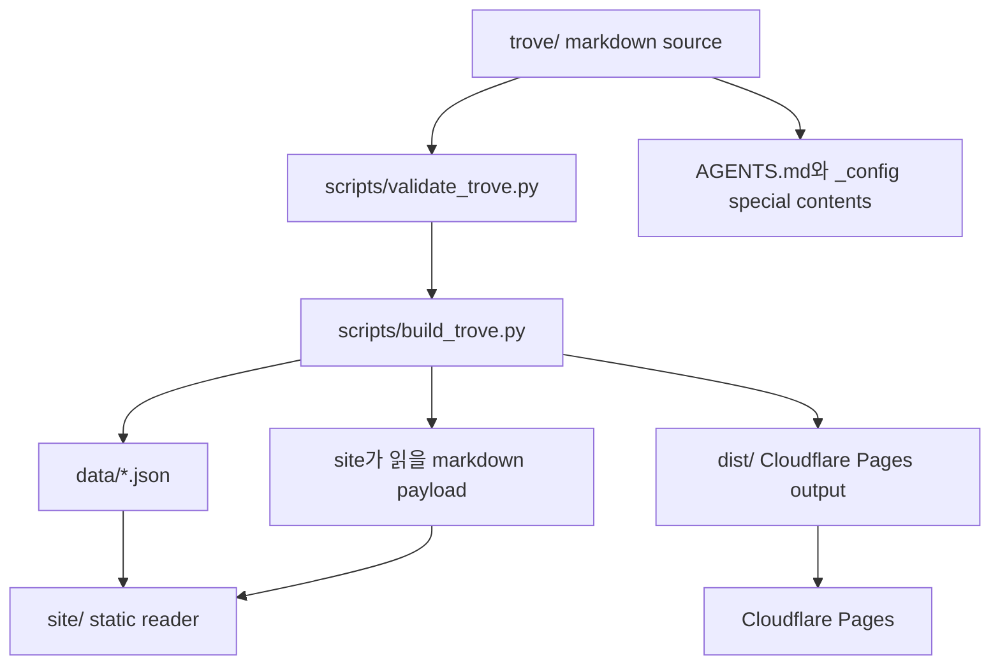

# 첫 번째 인스턴스 아키텍처

ACAC 첫 인스턴스는 `trove/` markdown source를 읽어서 public site와 agent-readable context로 바꾸는 정적 시스템이에요.
기존 reference knowledge base의 핵심은 가져오되, 지금은 jeina의 Obsidian 마이그레이션을 위한 첫 사용 사례에 맞춰 단순하게 시작해요.
초기 아키텍처의 핵심은 source와 output 분리, project 중심 문서 구조, `_config/` special contents, 검증 가능한 build예요.
브라우저 편집기, GitHub API 저장, 전체 graph, 전체 Obsidian import는 첫 구현 이후로 미뤄요.

## 설계 입력에서 가져오는 것

기존 reference knowledge base는 팀용 지식 베이스였고, ACAC 첫 인스턴스는 개인 Obsidian을 cloud context로 옮기는 제품이에요.
그래서 원칙은 가져오되 폴더와 기능은 다시 자릅니다.

| reference 원칙 | ACAC 첫 인스턴스 적용 |
|---|---|
| 파일 경로가 문서의 의미를 설명함 | `trove/Projects/<project>/...`와 `trove/Daily/...`를 사람이 읽을 수 있는 경로로 유지해요. |
| source와 output을 분리함 | `trove/`는 원본, `data/`와 site build 결과는 생성물이에요. |
| `index.md`가 폴더의 진입점임 | 프로젝트와 special contents folder에는 `index.md`를 둬요. |
| frontmatter와 wikilink를 표준으로 씀 | 모든 markdown 문서에 최소 frontmatter와 H1 요약을 둬요. |
| 영구 ID는 build가 관리함 | 첫 metadata build부터 `data/id-registry.json`을 만들고 `/trove/<id>` route를 지원해요. |
| 사이트는 정적 앱으로 충분함 | 첫 구현은 vanilla HTML/CSS/JS와 build script로 시작해요. |
| 편집기와 GitHub PAT 저장 기능 | 첫 구현에서는 제외해요. 읽기, 검색, 탐색이 먼저예요. |
| Cloudflare Pages 배포 | 첫 public deploy target은 Cloudflare Pages예요. output directory는 `dist/`예요. |
| Cloudflare Web Analytics | 첫 구현부터 page view 측정을 붙여요. token은 build-time config로 주입해요. |

## 전체 구조

ACAC 첫 인스턴스는 네 층으로 나눠요.



각 층의 책임:

| 층 | 책임 |
|---|---|
| `trove/` source layer | 사람이 직접 고치는 durable context 원본이에요. |
| `scripts/` validation/build layer | frontmatter, 링크, 폴더 규칙을 검사하고 site가 읽을 데이터를 만들어요. |
| `data/` metadata layer | tree, note metadata, search index, backlinks, home summary를 저장해요. |
| `site/` presentation layer | public reader UI예요. 첫 화면, sidebar, 문서 렌더링, 검색을 담당해요. |
| agent interface layer | root `AGENTS.md`와 `trove/_config/`가 agent가 읽는 규칙과 절차를 제공해요. |
| deploy layer | `dist/`를 Cloudflare Pages에 배포하고, 실제 route와 analytics를 확인해요. |

## Source layer

`trove/`는 ACAC가 관리하는 durable context root예요.
Obsidian의 vault를 그대로 복제하지 않고, 첫 인스턴스에 필요한 구조만 먼저 둬요.

```text
trove/
  Daily/
  Projects/
  _config/
    Agents/
    Memory/
    Skills/
    Commands/
  _assets/
  _archived/
```

폴더 경계:

| 폴더 | 역할 | public site 표시 |
|---|---|---|
| `Daily/` | 하루 단위 context hub와 worklog pointer | main sidebar 상단 |
| `Projects/` | 프로젝트별 결정, 설계, 작업 기록, 참고, 조사 | main sidebar 상단 |
| `_config/` | Memory, Skills, Commands, Agents 같은 special contents | 구분선 아래 하단 영역 |
| `_assets/` | 이미지와 첨부 파일 저장 | sidebar 숨김 |
| `_archived/` | 현재 기준에서 밀려난 문서 | 구분선 아래, 기본 접힘 |

언어 기준:

- `trove/Projects/`와 `trove/Daily/`는 한국어 원본이에요.
- `trove/_config/`는 영어 원본이에요.
- 영어 번역본은 한국어 원본이 안정화된 뒤 별도 `en/` 구조로 생성해요.
- 번역본과 원본이 충돌하면 한국어 원본이 이겨요.

## Document model

모든 markdown 문서는 frontmatter와 H1을 가져요.
초기 필수 필드는 단순하게 둡니다.

```yaml
---
type: design
title: Example Title
description: "One-line description"
status: draft
created: 2026-06-28
updated: 2026-06-28
visibility: public
---
```

필드 기준:

| 필드 | 기준 |
|---|---|
| `type` | 문서 역할이에요. 폴더와 완전히 같을 필요는 없지만, validator가 허용 목록을 검사해요. |
| `title` | H1과 같은 제목이에요. |
| `description` | 검색과 home summary에 쓰는 한 줄 설명이에요. 자연어라서 따옴표로 감싸요. |
| `status` | `draft`, `active`, `archived`로 시작해요. |
| `created` | 처음 만든 날짜예요. |
| `updated` | 의미 있게 고친 날짜예요. |
| `visibility` | `public`, `private`, `internal` 중 하나예요. 첫 public site는 `public`만 배포해요. |
| `id` | 사람이 직접 쓰지 않아요. build가 생성해 source frontmatter에 쓰고, `data/id-registry.json`을 기준으로 관리해요. |

초기 문서 타입:

| 타입 | 위치 예시 | 의미 |
|---|---|---|
| `index` | `trove/Projects/ai-context-as-code/index.md` | 폴더 진입점 |
| `daily` | `trove/Daily/YYYY-MM/YYYY-MM-DD.md` | 하루 단위 context |
| `project` | `trove/Projects/<project>/index.md` | 프로젝트 home |
| `decision` | `trove/Projects/<project>/Decisions/...` | 결정과 이유 |
| `design` | `trove/Projects/<project>/Designs/...` | 구조와 설계 |
| `worklog` | `trove/Projects/<project>/Worklog/...` | 작업 단위 기록 |
| `reference` | `trove/Projects/<project>/References/...` | 다시 찾아볼 설명과 가이드 |
| `research` | `trove/Projects/<project>/Research/...` | 조사 산출물 |
| `memory` | `trove/_config/Memory/...` | 장기 context |
| `skill` | `trove/_config/Skills/...` | 반복 workflow |
| `command` | `trove/_config/Commands/...` | 반복 command procedure |
| `agent-entry` | `trove/_config/Agents/...` | agent runtime entry document |

본문 기준:

- H1 바로 아래에 3-5줄 요약을 둬요.
- 처음 읽는 사람이 전체 그림을 먼저 잡고 세부 내용을 보게 써요.
- 한 문서는 하나의 주제만 다뤄요.
- wikilink는 파일명 stem 기준으로 걸어요.
- `reference`, `research`, `memory`는 최신 기준으로 다시 쓰는 문서예요.
- `decision`, `design`, `worklog`, `daily`는 시점과 맥락을 보존하는 문서예요.

## Visibility and safety

ACAC 첫 인스턴스는 public product surface가 필요하지만, local Obsidian에는 공개하면 안 되는 내용도 있어요.
그래서 첫 구현에서는 단순하고 보수적인 공개 기준을 둬요.

- public repo나 public site에 들어가는 문서는 `visibility: public`이어야 해요.
- private Obsidian 원문은 검토 없이 `trove/`로 복사하지 않아요.
- `visibility: private` 또는 `visibility: internal` 문서는 build가 public site payload에서 제외해요.
- 단, public repo에 파일이 올라가면 frontmatter로 숨겨도 원문은 노출돼요.
- private content를 다루려면 repo privacy, auth gate, 별도 private trove 중 하나가 먼저 필요해요.

첫 단계에서는 ACAC 자체 프로젝트 문서와 공개 가능한 예시만 넣어요.

## Validation layer

`scripts/validate_trove.py`는 source layer를 검사해요.
처음부터 완벽한 linter로 만들지 않고, 문서가 깨지는 지점부터 막아요.

초기 error:

- markdown 파일에 frontmatter가 없음
- 필수 frontmatter 필드 누락
- `title`과 H1 불일치
- H1 아래 3-5줄 요약 없음
- 허용되지 않은 `type`, `status`, `visibility`
- public build 대상인데 `visibility: public`이 아님
- `_assets/` markdown 문서가 sidebar 대상으로 잡힘

초기 warning:

- 깨진 wikilink 후보
- `index.md`에서 하위 노트 링크 누락
- `updated`가 오늘 수정과 맞지 않을 가능성
- `description`이 너무 길거나 비어 있음

validator는 build보다 먼저 실행해요.
error가 있으면 build를 멈추고, warning은 첫 구현에서는 보고만 해요.

## Build layer

`scripts/build_trove.py`는 `trove/`를 읽어서 site가 쓸 데이터를 만들어요.
첫 구현에서는 Python 표준 라이브러리 중심으로 시작하고, markdown rendering은 site 쪽에서 처리해요.

생성물:

| 파일 | 내용 |
|---|---|
| `data/tree.json` | sidebar tree와 folder ordering |
| `data/notes.json` | note id, route, path, title, type, status, visibility, summary, updated |
| `data/search-index.json` | title, description, summary, body snippet, tags |
| `data/backlinks.json` | wikilink 기반 링크와 역링크 |
| `data/home.json` | root README와 folder registry로 만든 첫 화면 데이터 |
| `data/id-registry.json` | path 변경에도 살아 있는 영구 ID registry |
| `data/build.json` | build 시각, public 문서 수, warning 수, analytics 설정 상태 |
| `_build/trove/` | site가 읽기 좋게 정규화한 markdown payload |
| `dist/` | Cloudflare Pages가 배포할 최종 output |

folder ordering:

1. `Daily/`
2. `Projects/`
3. special section separator
4. `_config/`
5. `_archived/`

`_assets/`는 tree와 search에서 숨기고, 참조한 문서를 통해서만 접근하게 해요.

`dist/` 조립 기준:

- `site/index.html`과 `site/assets/`를 `dist/`로 복사해요.
- `data/*.json`을 `dist/data/`로 복사해요.
- `_build/trove/` markdown payload를 `dist/content/trove/`로 복사해요.
- `dist/_redirects`를 생성해 `/trove/*`와 `/search`를 `index.html` app shell로 보내요.
- `dist/`는 deploy output이지 source가 아니므로 사람이 직접 편집하지 않아요.

## ID route and registry

ACAC 문서의 canonical public URL은 `/trove/<id>`예요.
파일 path는 URL이 아니라 breadcrumb, search result, registry 내부 매핑에만 써요.
이 기준은 첫 구현부터 적용해요.

ID 생성 기준:

| 항목 | 기준 |
|---|---|
| 길이 | 10자 |
| 문자 | URL-safe alphabet: `0-9`, `A-Z`, `a-z`, `_`, `-` |
| 생성 방식 | Python `secrets.choice` 기반 |
| 충돌 처리 | registry에 같은 ID가 있으면 다시 생성 |
| 중복 감지 | 같은 ID가 두 source file에 있으면 build error |
| source 반영 | missing ID는 source frontmatter에 삽입 |
| 이동 감지 | 기존 ID의 path가 바뀌면 `currentPath` 갱신, 과거 path는 `previousPaths`에 추가 |

ID 생성 흐름:

1. `scripts/build_trove.py`가 `trove/` 아래 markdown 문서를 스캔해요.
2. `_assets/` 아래 파일은 문서 ID 생성 대상에서 제외해요.
3. frontmatter의 `id`가 registry에 있으면 그 ID를 유지해요.
4. frontmatter에 `id`가 없고 path가 registry에 있으면 registry의 ID를 frontmatter에 복원해요.
5. frontmatter `id`도 없고 path도 registry에 없으면 새 ID를 생성해요.
6. 새 ID나 복원된 ID는 source frontmatter에 써요.
7. 같은 ID가 두 문서에서 발견되면 build를 멈춰요.
8. public payload에는 `visibility: public` 문서의 `/trove/<id>` route만 포함해요.

`data/id-registry.json` 형태:

```json
{
  "version": 1,
  "ids": {
    "V1StGXR8_Z": {
      "currentPath": "Projects/ai-context-as-code/Designs/first-instance-architecture.md",
      "title": "첫 번째 인스턴스 아키텍처",
      "type": "design",
      "visibility": "public",
      "created": "2026-06-28",
      "updated": "2026-06-28",
      "route": "/trove/V1StGXR8_Z",
      "previousPaths": []
    }
  },
  "paths": {
    "Projects/ai-context-as-code/Designs/first-instance-architecture.md": "V1StGXR8_Z"
  }
}
```

`data/notes.json`의 각 note item은 최소 아래 값을 가져요.

```json
{
  "id": "V1StGXR8_Z",
  "route": "/trove/V1StGXR8_Z",
  "path": "Projects/ai-context-as-code/Designs/first-instance-architecture.md",
  "title": "첫 번째 인스턴스 아키텍처",
  "type": "design",
  "status": "draft",
  "visibility": "public",
  "summary": "ACAC 첫 인스턴스는 ...",
  "updated": "2026-06-28"
}
```

ID와 path가 충돌할 때 기준:

- registry가 frontmatter보다 우선이에요.
- frontmatter `id`가 registry의 다른 path에 묶여 있으면 build error예요.
- path가 바뀌었지만 ID가 같으면 같은 문서 이동으로 보고 registry를 갱신해요.
- path가 같고 ID가 바뀌었으면 registry의 ID로 source frontmatter를 복원해요.

## Presentation layer

`site/`는 ACAC의 public reader예요.
첫 화면은 `trove/Home.md`가 아니라 root `README.md`와 `data/home.json`으로 만들어요.

첫 구현 기능:

| 기능 | 기준 |
|---|---|
| Home view | ACAC가 무엇이고, 각 폴더가 어떤 역할인지 보여줘요. |
| Sidebar tree | `Daily/`, `Projects/`, special contents를 위계에 맞게 보여줘요. |
| Note route | `/trove/<id>`로 markdown 문서를 열어요. |
| Markdown rendering | H1, heading, code block, table, wikilink를 읽기 좋게 보여줘요. |
| Search | title, description, summary 중심으로 먼저 검색해요. |
| Backlinks | wikilink 기반 역링크를 문서 하단이나 오른쪽 영역에 보여줘요. |
| Empty/error state | 문서가 없거나 build가 깨졌을 때 이유를 보여줘요. |

초기 route:

| route | 의미 |
|---|---|
| `/` | Home view |
| `/trove/<id>` | 모든 markdown 문서의 canonical note view |
| `/search?q=<query>` | 검색 결과 |

Hash route는 쓰지 않아요.
Cloudflare Web Analytics와 공유 링크가 실제 path를 인식할 수 있도록 History API 기반 실제 URL route를 써요.
정적 배포에서는 `/trove/<id>`와 `/search`가 모두 `site/index.html` app shell로 들어오도록 fallback을 설정해요.

Cloudflare Pages fallback:

```text
/trove/* /index.html 200
/search /index.html 200
```

위 규칙은 `dist/_redirects`에 들어가요.
문서별 canonical URL은 여전히 `/trove/<id>`이고, markdown payload URL은 내부 fetch용 경로예요.

ID registry 기준:

- build가 새 markdown 문서에 ID를 부여하고 source frontmatter에 써요.
- ID는 10자 URL-safe 문자열이에요. Python `secrets`로 만들고, 충돌하면 다시 생성해요.
- `data/id-registry.json`은 `id -> currentPath`와 `path -> id`를 함께 가져요.
- 문서 frontmatter의 `id`와 registry가 충돌하면 registry가 이겨요.
- 문서가 이동되면 `previousPaths`에 과거 path를 남기고 `/trove/<id>`는 새 path를 보여줘요.
- 파일 path는 URL이 아니라 breadcrumb와 내부 매핑에만 써요.

처음에는 아래 기능을 만들지 않아요.

- 브라우저 편집기
- GitHub PAT 저장
- 새 노트 생성, 이동, 삭제 modal
- favorites, tabs, presentation mode
- full graph view
- Obsidian 전체 import UI

## Agent interface layer

ACAC는 사람이 읽는 사이트이면서 agent가 읽는 context repository예요.
agent-facing content는 `_config/` 아래에서 markdown으로 관리해요.

초기 기준:

- root `AGENTS.md`는 agent가 처음 읽는 얇은 entry file이에요.
- 실제 장기 원칙은 `trove/_config/Memory/`에 둬요.
- `trove/_config/Skills/`는 반복 workflow를 담아요.
- `trove/_config/Commands/`는 반복 command procedure를 담아요.
- `trove/_config/Agents/`는 `common.md`, `agent.md`, `claude.md` 같은 runtime entry source 문서를 담아요.
- 같은 내용이 중복되면 `Memory/`가 설명 원본이고, `Agents/`, `Skills/`, `Commands/`는 실행하기 쉬운 형태로 요약해요.

첫 구현에서는 repo-local sync만 만들어요.
`scripts/sync_agent_docs.py`는 `_config/Agents/` source를 읽어서 root `AGENTS.md`와 `CLAUDE.md`를 생성해요.
전역 runtime entry인 `~/.codex/AGENTS.md`, `~/.claude/CLAUDE.md`, 전역 skill folder는 자동으로 건드리지 않아요.
먼저 `_config/`가 content로 잘 읽히고, 사람이 봐도 구조가 이해되는지 확인해요.

## Deploy and analytics layer

첫 public deploy target은 Cloudflare Pages예요.
Cloudflare Pages는 build command exit code로 성공과 실패를 판단하므로, validator error가 있으면 build script가 non-zero exit code로 멈춰야 해요.

Cloudflare Pages 기준:

| 항목 | 기준 |
|---|---|
| build command | `python3 scripts/build_trove.py` |
| output directory | `dist` |
| route fallback | `dist/_redirects` |
| custom domain | `acac.sh` |
| deploy blocker | validator error, duplicate ID, public payload safety error |

Cloudflare Web Analytics 기준:

- 첫 구현부터 포함해요.
- token은 `ACAC_CF_WEB_ANALYTICS_TOKEN` build-time environment variable로 받는 것을 기본으로 해요.
- token이 있으면 build가 output HTML에 Cloudflare beacon script를 주입해요.
- token이 없으면 analytics를 비활성화하고 `data/build.json`에 그 상태를 기록해요.
- Cloudflare Pages dashboard의 one-click Web Analytics를 쓰는 경우에는 manual token injection과 동시에 켜지 않아요.
- History API route를 쓰기 때문에 `/trove/<id>` page view가 문서 단위로 남을 수 있어요.

## 비목표

- local Obsidian 전체를 한 번에 옮기지 않아요.
- private content를 public repo나 public site에 넣지 않아요.
- 첫 구현에서 auth, permission, browser editing을 만들지 않아요.
- 첫 구현에서 graph, tabs, favorites, presentation mode를 만들지 않아요.
- 첫 구현에서 repo 밖 agent runtime config를 자동 생성하거나 배포하지 않아요.
- 첫 구현에서 범용 오픈소스 템플릿을 완성하지 않아요.

## 확인 기준

이 아키텍처의 첫 구현이 끝났다고 보려면 아래가 되어야 해요.

- `trove/`만 봐도 ACAC 첫 인스턴스의 문서 구조가 이해돼요.
- `python3 scripts/validate_trove.py`가 source 문서의 기본 오류를 잡아요.
- `python3 scripts/build_trove.py`가 `data/*.json`, markdown payload, Cloudflare Pages output인 `dist/`를 만들어요.
- site 첫 화면이 `README.md`와 generated home data를 기반으로 열려요.
- sidebar에서 main context와 special contents가 분리되어 보여요.
- `_assets/`는 사용자 탐색 대상이 아니라 내부 storage로 남아요.
- public site에는 `visibility: public` 문서만 올라가요.
- `trove/Projects/ai-context-as-code/`가 첫 실제 프로젝트 예시로 작동해요.
